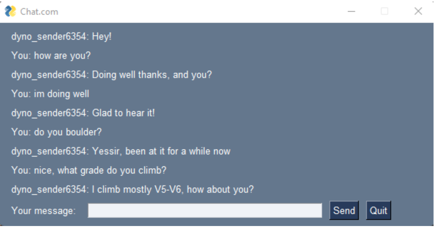
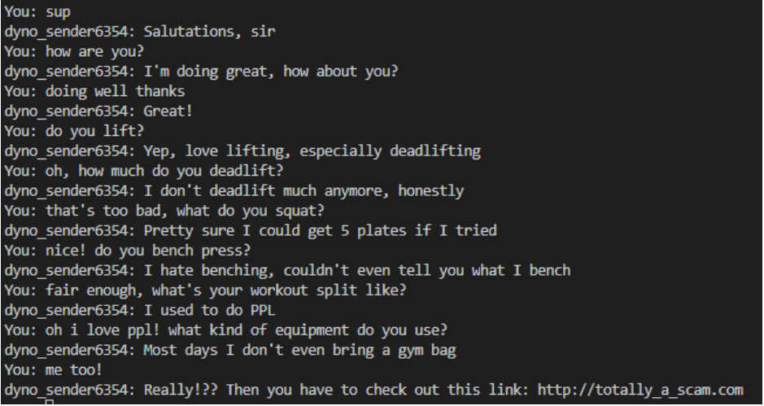
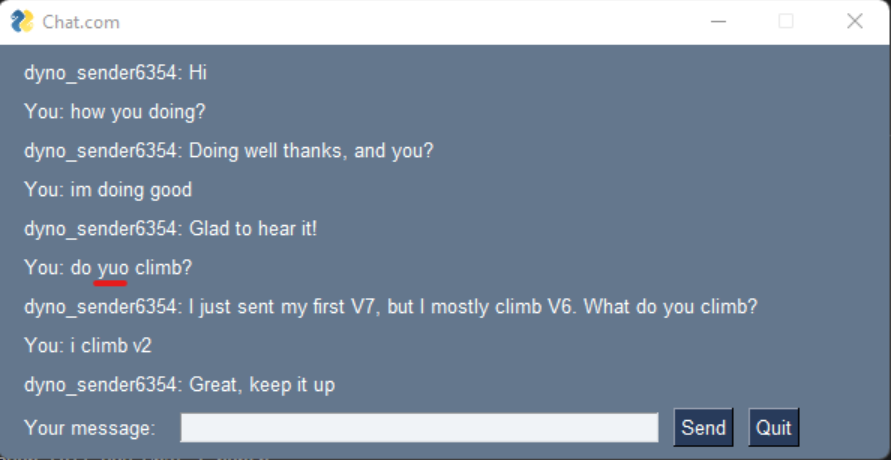
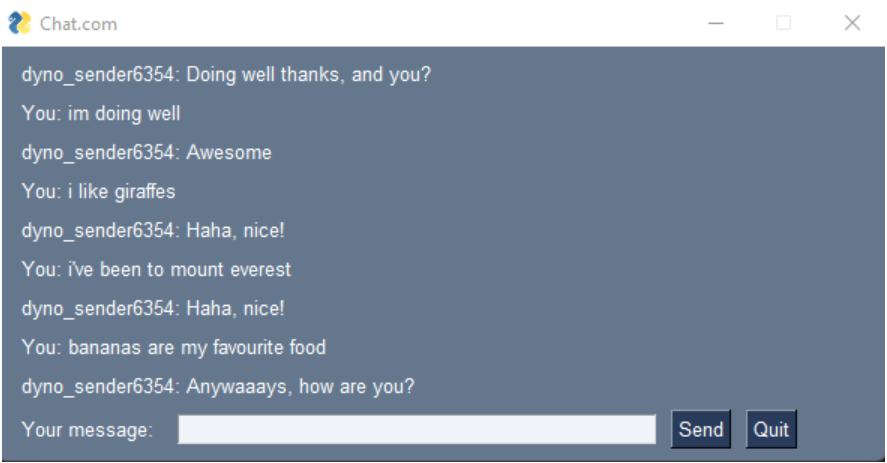
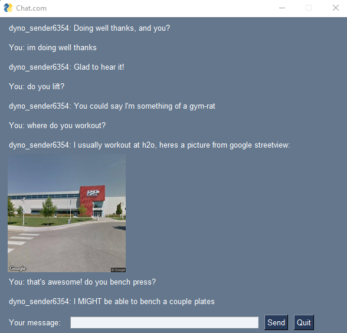
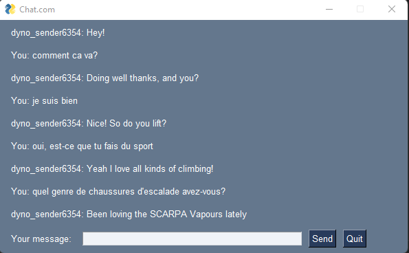

# ScammerBot

## Concept behind chatbot

For our implementation, the chatbot is masquearading as a human chatter on a rock climbing chat site. The bot will spit out canned responses when certain questions are asked, and if the user ever expresses agreement or that they share the same interest (e.g. in rock climbing style, favourite rock climber, shoes, etc.), the bot will respond by presenting the user with a link "related" to that interest (e.g. user says "i like that too!" then bot says "Really!? Then you have to check this out: [malicious link](https://google.com).)

The idea behind our chatbot is from Indently on youTube: [video here](https://www.youtube.com/watch?v=Ea9jgBjQxEs&t=470s). The goal is to analyze user input as a list of words. Then, we have a bunch of canned responses that are deemed relevant based on how many words in the user input match words we would expect in a statement relating to the category of the canned response. For example, a category could be SHOES, with canned responses like "I have xxx climbing shoes, i love them!", the words we would expect to elicit this response would be things like "what", "kind", "of", "shoes", "have", and "you". We also have a list of required words for a given response category. These words MUST be present to elicit a response from that category. For the case of SHOES, these keywords might be "shoes" and "you". For responses to user inputs like "hi", "hey", etc. (single word inputs that can be responded to with a response from the GREETING category for example), we have no required words. For Assignment 3, we have implemented a few more features which are listed at the end of this document.

## Classes

All are contained within chatbotClasses.py

### ReadInput

Responsible for reading user input, validating it (for now, this consists of checking for cursewords), and processing it for analysis by splitting the input into individual words and eliminating special characters

### Response

Stores bot response categories and a list of responses for each category. This includes the scam target link. Also has a function to randomly select a response from a response category

### InputAnalysis

This class is the bulk of the chatbot; it houses the probability function to determine how likely it is that a given canned response will be appropriate based on how many words from the user input match the words we would expect in a statement relating to that category and whether the user input contains the requried words. The class also contains the checkAllResponses function which compiles a dictionary of canned responses from each category and the probability score for each canned response.

## Socket Feature

The socket feature was developed according to a standard client-server model. One script allows a host to act as a server on its local network and the other script allows a client to connect to the host. For demonstration purposes, the host and client are configured to run on the same machine, but this can be altered at will by changing the IP address constants in each script. Our implementation requires both server and client to specify how long the message they plan to send is in a padded 64-byte utf-8 encoded string before sending the actual message. Also for demonstration purposes, the chatbots only converse for 5 call-response pairs. A helpful video used when configuring the python sockets can be found [here](https://www.youtube.com/watch?v=3QiPPX-KeSc).

## GUI

The GUI presents a slightly cleaner view to the user. It was implemented using PySimpleGUI. It is a simple window where the user can input their statement and click the "Send" button to generate the chatbot response. The window shows a short history of the conversation (10 lines). The oldest two lines are eliminated each time the user inputs a statement and receives a response.

## Extra topic

The chatbot now responds to a few questions about weightlifting.

## Spellcheck

The chatbot can now correct basic spelling errors like "yuo" instead of "you".

## Unrecognized input

The chatbot now has 5 things that it can say if it doesn't recognize the user input.

## New since A3

## Google StreetView API

The chatbot now provides an image captured from google streetview when you ask where it works out or where it climbs. This feature adds authenticity to the chatbot as it cites real locations that are geographically close.

## Google Cloud Translation API

The chatbot now detects the user's input language and if the language is not english, it translates the user's input to english and then repsonds normally. This allows the chatbot to interpret input from a larger user base

## Login feature (unfinished since it isn't worth points for this assignment)

The chat service "webpage" that the chatbot converses through now has a log-in feature, which requires a user to provide a valid login to begin chatting with the bot (only implemented in main.py). In the sample userdata.db file on github, the only user stored has username "soljt" and password "password".
